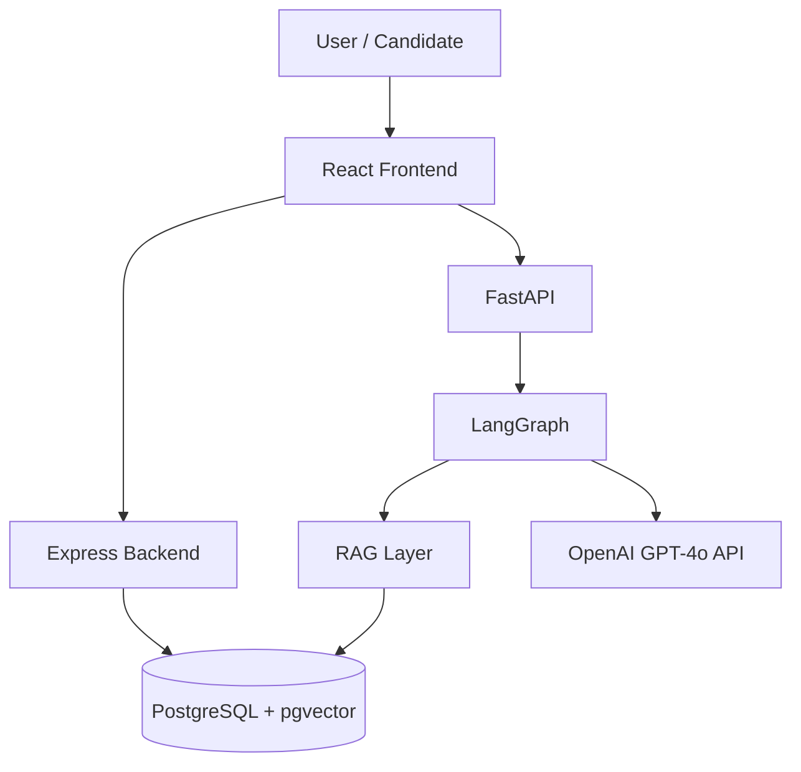

# HireGraph
An AI-driven technical interviewer built with LangGraph, FastAPI, and the PERN stack. Features agentic routing, RAG-based grading, and real-time feedback.

### Architectural Breakdown
* **Frontend:** Built with React, managing interactive web sockets for lower latency conversational updates and a dynamic dashboard for viewing candidate code execution and interview progress.
* **Core Application Server (Node.js/Express):** Manages user sessions, authentication, data persistence, and serves as the central API gateway.
* **AI Orchestration Server (FastAPI):** Hosts the LangGraph state machine. It handles multi-agent execution, conversational history management, and grading routing without blocking the application server threads.
* **Storage & Knowledge Base:** Uses PostgreSQL for operational storage and relational data, utilizing the `pgvector` extension to run semantic vector similarity lookups against interview grading rubrics.

---

## 🚀 Getting Started

Follow these steps to clone, configure, and spin up the complete local development environment.

### Prerequisites
* **Node.js** (v18+ recommended)
* **Python** (3.10+ recommended)
* **PostgreSQL** (with `pgvector` installed and enabled)

---

## 🏗️ System Architecture

